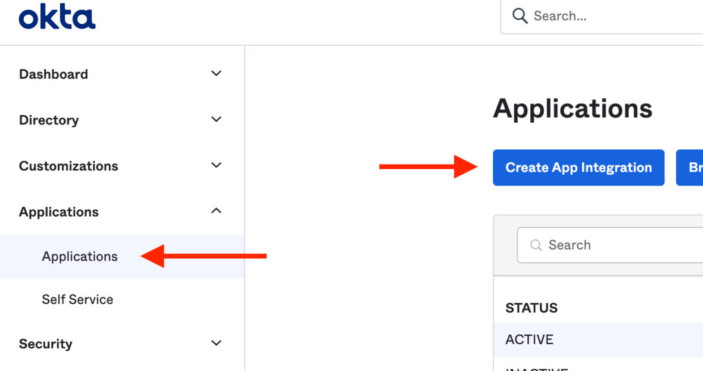
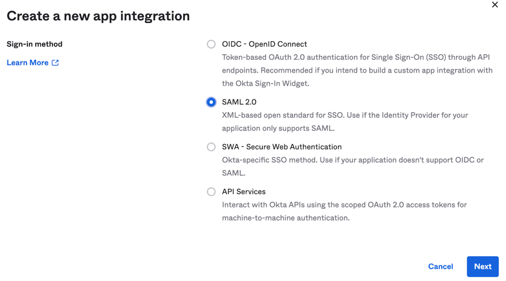
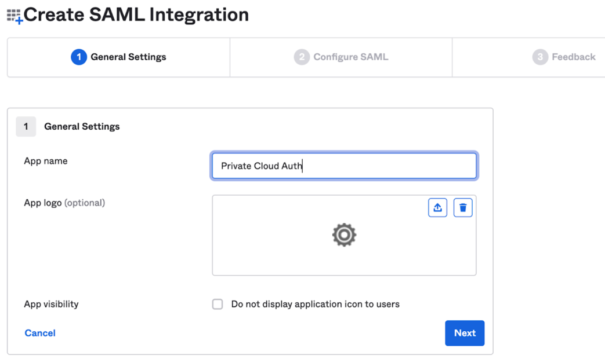
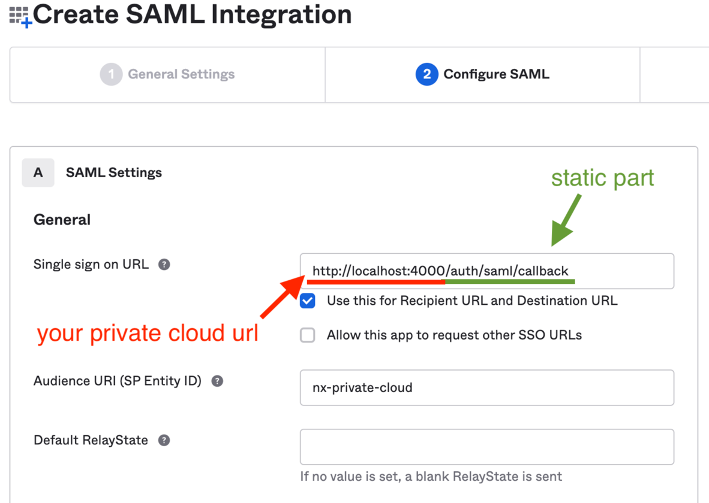
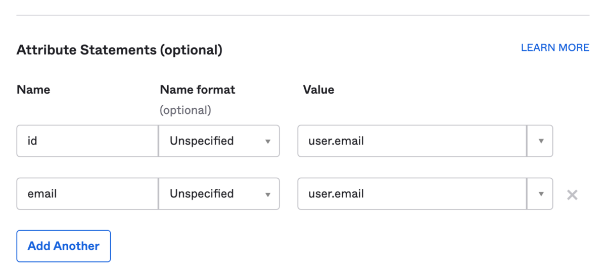
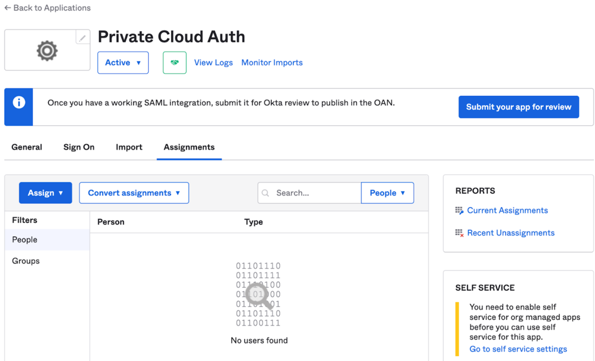
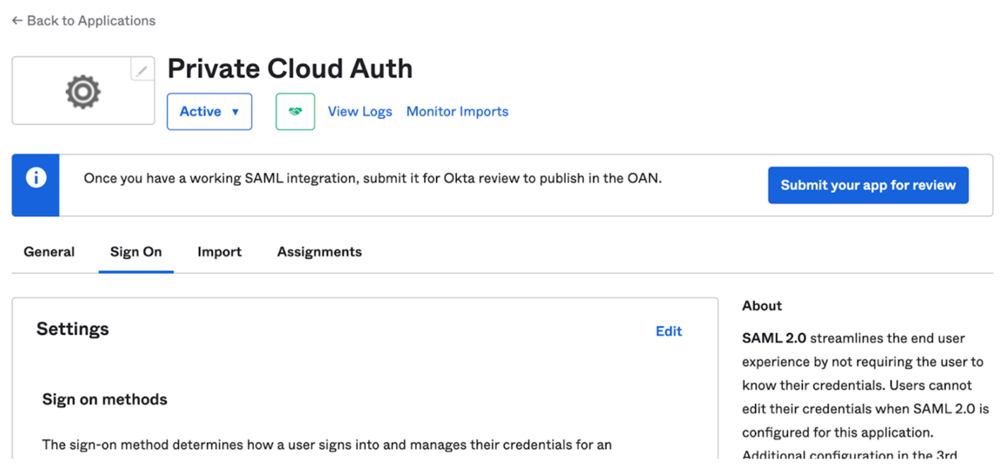
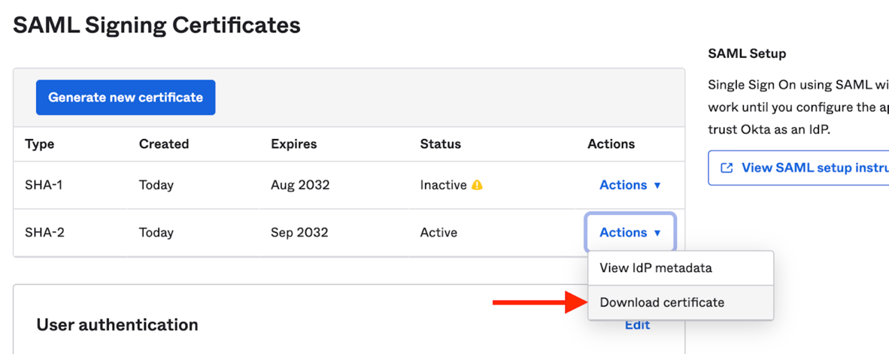
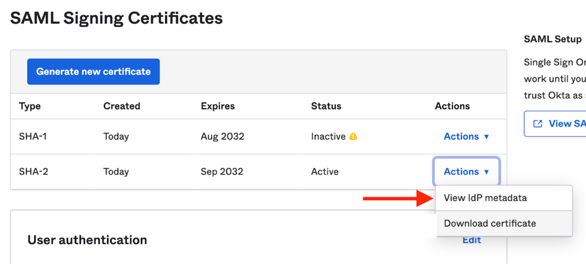
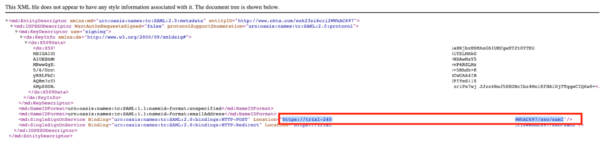

# SAML Auth

## Okta Set-up

You'll need the `SAML-IDENTIFIER` from us, unique to your org. We'll provide this once we start setting SAML up for you.
You'll be entering it in the instructions below.

1. Create a new Okta App Integration:

   

   

2. Give it a name:

   

3. On the Next page, configure it as below:

   1. The Single Sign On URL needs to be `https://auth.nx.app/login/callback?connection=SAML-IDENTIFIER`
   2. The Audience should be `urn:auth0:nrwl:SAML-IDENTIFIER`

   

4. Scroll down to attribute statements and configure them as per below:

   

5. Click “Next”, and select the first option on the next screen.
6. Go to the assignments tab and assign the users that can login to the NxCloud WebApp:

   1. **Note:** This just gives them permission to use the NxCloud web app with their own workspace. Users will still need to be invited manually through the web app to your main workspace.

   

7. Then in the Sign-On tab scroll down:

   

8. Scroll down and from the list of certificates, download the one with the “Active” status:

   

10. Then view the ldP metadata:

    

11. Then find the row similar to the below, and copy the highlighted URL (see screenshot as well):

    1. ```html
       <md:SingleSignOnService
         Binding="urn:oasis:names:tc:SAML:2.0:bindings:HTTP-POST"
         Location="https://trial-xxxxx.okta.com/app/trial-xxxxx_nxcloudtest_1/xxxxxxxxx/sso/saml"
       />
       ```

    

12. Send us via email: 
    - your *public* certificate downloaded in step 8
    - your URL from step 11
